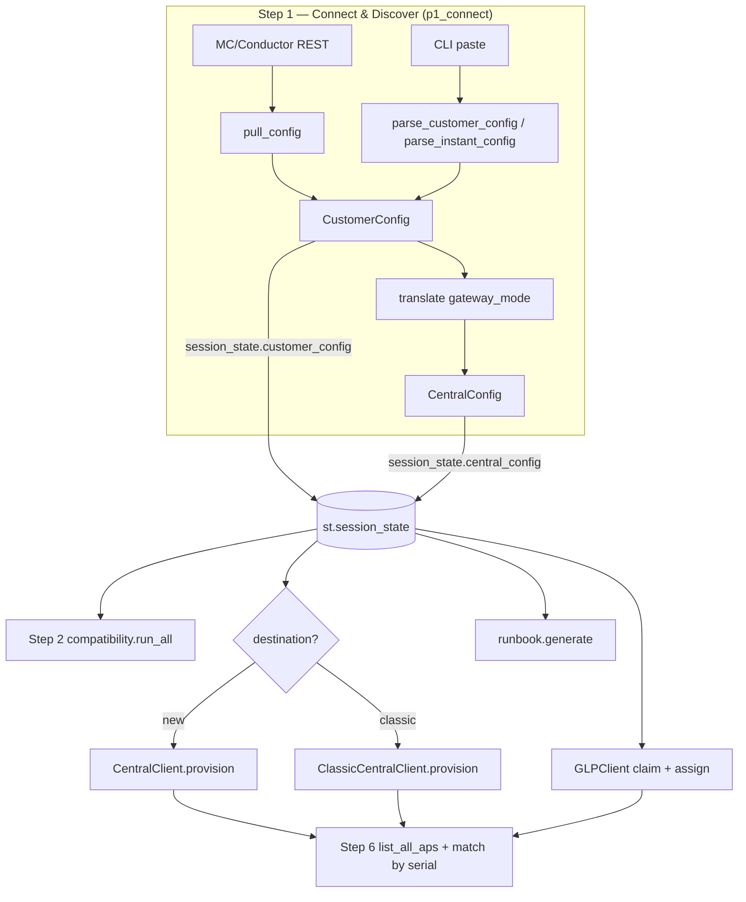

# Architecture

Code map, data flow, and session-state model for the Migration Console.

## Layout

```
app.py                     # entrypoint: page config, CSS, step router, reset hook
lib/
  models.py                # dataclasses: source (CustomerConfig) + target (CentralConfig)
  aos8_client.py           # AOS 8 MC/Conductor REST client + model/firmware helpers
  aos8_parser.py           # CLI-paste parser (MC + Instant) → CustomerConfig
  translator.py            # CustomerConfig → CentralConfig (gateway keep/retire)
  compatibility.py         # preflight checks → list[CheckResult]
  central_client.py        # New Central (GreenLake) REST client + provision()
  classic_central_client.py# Classic Central (apigw) REST client + provision()
  glp_client.py            # HPE GreenLake Platform: claim + subscription assign
  runbook.py               # ap convert / Central-driven runbook text generator
  styles.py                # dark "mission control" design system + HTML helpers
  identity.py              # operator identity resolution (AOS8_AUTH_MODE)
  auth_ui.py               # login gate UI for password/accounts modes
  accounts.py              # self-service account store (verified email)
  credstore.py             # opt-in encrypted per-user credential store
  audit.py                 # per-user audit log of write actions
  session_clients.py       # cached per-session Central/GLP client factories
  cleanup.py               # "Clean up test objects" tool (zztest-* deletion)
  testdata.py              # built-in test customer for demos/labs
  api_probe.py             # Step 1 "Test API connectivity" endpoint probes
  api_catalog.py           # catalog of every REST endpoint the tool can call
  help_docs.py             # "Help & Docs" mode renderer
  help_content.py          # per-step help text content
  mailer.py                # verification-email delivery (accounts mode)
  postman.py               # Postman collection export
views/
  add_devices.py           # "Add devices only" mode (claim/assign outside the wizard)
  p1_connect.py            # Step 1: Connect & Discover (chooses the path)
  p2_preflight.py          # Step 2: Preflight Checks
  p3_provision.py          # Step 3: Build Config (provisions the target config in Central)
  p4_greenlake.py          # Step 4: Onboard APs (GreenLake claim + subscription + cutover move)
  p5_runbook.py            # Step 5: AP Convert Runbook
  p6_validate.py           # Step 6: Validate
```

## Module responsibilities

### lib/ — clients

| Module | Class | Responsibility |
|---|---|---|
| `aos8_client.py` | `AOS8Client` | Login (`/v1/api/login`, UIDARUBA), read `/v1/configuration/object/*` and `showcommand`, assemble a `CustomerConfig`. Also hosts `is_model_compatible` + the `INCOMPATIBLE_MODELS` set and shared helpers (`_opmode_to_auth`, `_normalize_model`, `_safe_vlan`, `_vlan_is_named`). |
| `central_client.py` | `CentralClient` | New Central: SSO token, scope-maps, sites, device groups, VLANs, roles/policies, overlay/underlay SSIDs, GW cluster, auth servers, firmware compliance, validation. Per-run caches for groups/sites/roles/policies. |
| `classic_central_client.py` | `ClassicCentralClient` | Classic Central: access-token auth + rotating refresh, v3 AOS10 groups (with Architecture readback), device inventory/move, sites, `full_wlan` WLANs, firmware v2→v1, monitoring. |
| `glp_client.py` | `GLPClient` | GreenLake Platform: client-credentials token, async device claim + poll, workspace reconciliation, subscription resolve + assign. |

### lib/ — data transforms

| Module | Entry point | Responsibility |
|---|---|---|
| `aos8_parser.py` | `parse_customer_config()`, `parse_instant_config()` | Parse pasted CLI output into a `CustomerConfig`. `parse_cli_table()` anchors on the dash separator row for exact column slicing. Instant parsing maps zones → groups. |
| `translator.py` | `translate()` | Map a `CustomerConfig` → `CentralConfig`. Honors `gateway_mode` ("keep"/"retire"). Builds one `CentralGroupConfig` per AP group, computes the GW cluster name, and decides tunnel-vs-bridge per group. |
| `compatibility.py` | `run_all()` | Run every preflight check; return `list[CheckResult]` (PASS/WARN/FAIL). Hosts `SUPPORTED_TRAINS` + `_fw_ok()` (reused by `runbook.py`). |
| `runbook.py` | `generate()` | Produce the `ap convert` (MC) or Central-driven (Instant) runbook, branching on cluster type and gateway strategy. |

### Data model (lib/models.py)

Source side (discovery): `CustomerConfig` holds `ap_groups: [APGroup]`,
`ssids: [SSID]`, `aps: [AP]`, `vlans: [VLAN]`, `radius_servers`, `server_groups`,
`roles`, `cluster: ClusterInfo`, plus `source_type` ("controller"|"instant") and
flags `has_eap_offload`, `has_internal_auth`, `ssid_mapping_incomplete`.

Target side (after `translate`): `CentralConfig` holds `destination`
("new"|"classic"), `groups: [CentralGroupConfig]`, `sites`, `radius_servers`,
`gw_cluster_name`/`gw_serial`, `gateways_retired`, and the site address fields.
Each `CentralGroupConfig` carries its resolved `ssids`/`vlans` and
`has_tunnel_ssid`/`has_bridge_ssid` flags.

`SSID` is the binding key between layers: `forward_mode` (ForwardMode enum),
`auth_type` (AuthType enum), `auth_known`, `vlan_raw` (set for unresolved named
VLANs), `display_name` (essid, falling back to the virtual-AP (VAP) profile name).

## Data flow

```
                          ┌─────────────────────────────────────────────┐
   AOS 8 source           │  Step 1: views/p1_connect.py                 │
   ┌──────────────┐       │                                              │
   │ MC / Conductor│─REST─▶│ aos8_client.AOS8Client.pull_config()  ──┐    │
   │  (port 4343) │       │                                          │    │
   └──────────────┘       │ aos8_parser.parse_customer_config()  ────┤    │
   ┌──────────────┐       │ aos8_parser.parse_instant_config()   ────┤    │
   │ MC/Instant   │─paste▶│                                          ▼    │
   │  CLI output  │       │                               CustomerConfig  │
   └──────────────┘       │                                          │    │
                          │  translate(gateway_mode) ────────────────▼    │
                          │                               CentralConfig   │
                          └───────────────┬──────────────────────────────┘
                                          │ (stored in st.session_state)
            ┌─────────────────────────────┼───────────────────────────────┐
            ▼                             ▼                                ▼
   Step 2: compatibility       Step 3: *_central_client          Step 4: glp_client
   .run_all(customer,central)  .provision(central, ap_serials)   claim + assign subs
   → [CheckResult]             → [(label, ok, detail)]           → workspace reconcile
            │                             │                                │
            └─────────────┬───────────────┴────────────────┬──────────────┘
                          ▼                                 ▼
              Step 5: runbook.generate()         Step 6: client.list_all_aps()
              (ap convert / Central-driven)      match by serial → online?
```



## Step routing (app.py)

`app.py` keeps the current step index in `st.session_state.step` (clamped to
0..5). Before any page renders, app.py resolves the operator identity
(`AOS8_AUTH_MODE`; login gate or proxy-header check) and a sidebar Mode radio
selects one of three modes: Full migration (the 6-step wizard below), Add
devices only (`views/add_devices.py`), and Help & Docs (`lib/help_docs.py`).
The step router applies to Full migration mode: app.py renders the brand header
and the step-progress bar, then imports and calls `render()` on exactly one
view module based on the index. The sidebar summary renders **last** so it
reflects any state changes made during the run.

```
STEPS = [1_connect, 2_preflight, 3_provision, 4_greenlake, 5_runbook, 6_validate]
session_state.step → views.pN_*.render()
```

Each view advances by setting `st.session_state["step"] = N` and calling
`st.rerun()`. Views guard themselves: every step after 1 errors out with a
"complete Step 1 first" message if `customer_config`/`central_config` are absent.

## Session-state keys

All cross-step state lives in `st.session_state` (in-memory, per browser
session — nothing is written to disk).

### Inputs and identity

| Key | Set by | Meaning |
|---|---|---|
| `step` | app.py / views | Current wizard index (0–5). |
| `customer_name`, `site_name`, `site_address`/`_city`/`_state`/`_country`/`_zipcode` | p1 | Customer + site fields. |
| `source_type` | p1 | "controller" or "instant". |
| `mc_ip`, `mc_user`, `mc_config_path`, `mc_mode` | p1 | MC connection details; `mc_mode` is "api" or "paste". |
| `dest_type` | p1 | "new" or "classic". |
| `central_base` / `central_base_classic` | p1 | Regional New Central base / classic apigw base. |
| `central_client_id`, `central_secret` | p1 | Central (and unified-GLP) credentials. |
| `classic_access_token`, `classic_refresh_token` | p1, p3, p4, p6 | Classic token + rotating refresh token (updated after refresh). |
| `aos10_fw` | p1 | Target AOS 10 version string. |
| `gw_strategy` | p1 | "keep" or "retire". |
| `glp_use_central_creds`, `glp_client_id`, `glp_secret` | p4 | GLP credential source. |
| `paste_*` / `ipaste_*` | p1 | Per-command text areas (MC / Instant paste). |

### Derived / result state (cleared on rediscovery)

| Key | Set by | Meaning |
|---|---|---|
| `customer_config` | p1, p2 (VLAN fix), p4 (MAC edit) | The discovered `CustomerConfig`. |
| `central_config` | p1 (on Continue), p2 (VLAN fix re-translate) | The translated `CentralConfig`. |
| `preflight_results` | p2 | Cached `list[CheckResult]`. |
| `provision_done`, `provision_results` | p3 | Provisioning completion flag + `[(label, ok, detail)]`. |
| `glp_existing` | p4 | Sorted workspace serials snapshot. |
| `glp_subscriptions` | p4 | Loaded subscription list. |
| `glp_claim_result` | p4 | `{ok, failed}` reconciled against the workspace. |
| `glp_sub_results` | p4 | `[(serial, ok, err)]` for subscription assignment. |
| `glp_service_managers` | p4 | Central application instances (id/region) loaded from GLP. |
| `onboard_results` | p4 | `[(label, ok, detail)]` from the devices-phase cutover move. |
| `probe_results` | p1 | API endpoint probe results. |
| `macedit_result` | p4 | `{applied, bad}` from the wired-MAC editor. |
| `validation_results` | p6 | Raw AP list fetched from Central. |
| `validation_celebrated` | p6 | One-shot guard so balloons fire once. |
| `_reset_downstream` | app.py | Callable injected for the reset hook (below). |
| `preflight_override` (p2 widget key), `check_*`/`chk_*` | p2, p6 | Blocker-override checkbox; checklist widget keys mirrored into durable `chk_*` keys (the `chk_*` keys are what reset clears). |

### Reset-on-rediscovery flow

`app.py` defines `reset_downstream_state()` and stashes it as
`st.session_state["_reset_downstream"]`. Step 1's `_store_discovery()` calls it
**every time** a new `customer_config` is stored (API pull, MC paste, or Instant
paste):

```python
# app.py
def reset_downstream_state():
    for key in ("central_config", "preflight_results", "provision_done",
                "provision_results", "validation_results",
                "glp_existing", "glp_subscriptions", "glp_claim_result",
                "glp_sub_results", "glp_service_managers", "onboard_results",
                "probe_results", "validation_celebrated", "macedit_result"):
        st.session_state.pop(key, None)
    # the Step 6 closeout checklist is mirrored into durable chk_* keys —
    # a new engagement starts with an unticked checklist
    for key in [k for k in st.session_state.keys() if str(k).startswith("chk_")]:
        st.session_state.pop(key, None)

# p1_connect.py
def _store_discovery(cfg):
    st.session_state["customer_config"] = cfg
    st.session_state["_reset_downstream"]()   # wipe everything downstream
```

This guarantees that discovering a second deployment (or re-pulling the same one)
cannot leak stale preflight results, provisioning outcomes, GreenLake state, or
validation data from a previous engagement into the new one. `central_config` is
intentionally in the reset set: it is rebuilt by `translate()` only when Step 1's
Continue button is pressed, so after a rediscovery the user must pass through
Step 1 again before any downstream step has data.

## Provisioning orchestration

Both `provision()` methods use the same shape: an inner `step(label, fn)` helper
that runs `fn`, appends `(label, ok, detail)` to a results list, calls the
`on_step` callback (which streams a live line into the Streamlit UI via
`provision_step_line`), and **continues on failure**. Failures are recorded, not
raised, so the operator gets a complete picture. The only hard stop is when the
global scope can't be resolved (New Central) — nothing else can proceed.

Idempotency is by name: sites, groups, VLANs, SSIDs, auth servers and clusters
all check-or-reuse, and "already exists"/"duplicate" errors are swallowed as
success. Both Central clients cache the group/site lists per run (New Central: `_groups_cache`/`_sites_cache`; classic: `_group_names_cache`/`_sites_cache`). The New Central client additionally
de-dups role/policy ensure-sequences via `_ensured_roles` / `_ensured_policies`.

## Styling

`lib/styles.py` is a self-contained design system (dark navy, Aruba orange,
IBM Plex / Barlow Condensed). All dynamic values rendered inside
`unsafe_allow_html` markup pass through `esc()`. Component helpers
(`page_header`, `section_label`, `badge`, `check_card`, `provision_step_line`,
`step_progress`, `ssid_tag`, `mono_row`, `info_banner`, `sidebar_summary`,
`telemetry_chip`) cover the shared components; views use these plus local
inline-HTML blocks (also via `unsafe_allow_html`) for page-specific layout.
