# Migration Guide

Operator walkthrough of the AOS 8 → AOS 10 Migration Console. Read this start to
finish before your first engagement, then keep the per-step tables handy on
subsequent runs.

> **First time using the tool?** Do the 5-minute, zero-risk demo in
> [Getting Started](GETTING-STARTED.md) first — it uses the built-in test
> customer, so you'll recognize every screen in this guide before touching
> anything real.

The tool is a 6-step Streamlit wizard. It discovers an AOS 8 deployment, runs
preflight checks, provisions the destination Central tenant, onboards the APs in
HPE GreenLake, generates an `ap convert` runbook, and validates the result:

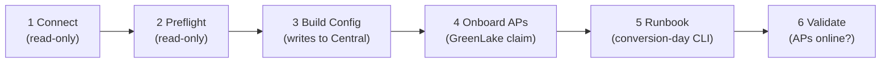

```bash
pip install -r requirements.txt
streamlit run app.py          # opens http://localhost:8501
```

> **Screenshots** in this guide come from a real run of the wizard using the
> built-in `zztest` test customer (Step 1 → *Load test customer*), so you can
> reproduce every screen yourself without a controller or tenant.

**Jargon buster** — the five terms this guide can't avoid:

| Term | Meaning |
|---|---|
| **AOS 8 / AOS 10** | The old (controller-based) and new (cloud-managed) Aruba operating systems. This tool moves you from 8 to 10. |
| **MC / MM** | Mobility Controller / Mobility Conductor — the on-prem AOS 8 appliances. |
| **IAP / Instant** | Controller-less AOS 8 APs that elect a "virtual controller" among themselves. |
| **Central (New vs Classic)** | Aruba's cloud manager. *New Central* lives on the HPE GreenLake platform; *Classic Central* is the earlier standalone version. Your tenant is one or the other — the tool supports both. |
| **GLP / GreenLake** | HPE's cloud platform. Devices must be *claimed* into a GreenLake workspace and given a *subscription* before Central will manage them. |
| **`ap convert`** | The AOS 8 CLI command that flips an AP to the AOS 10 image — the actual moment of migration for controller-based APs. |

**The wizard at a glance:**

| Step | Screen | You need | It writes to |
|---|---|---|---|
| 1 Connect | discovery + destination creds | MC/VC access or CLI paste, Central API creds | nothing |
| 2 Preflight | pass/warn/fail checks | — | nothing |
| 3 Build Config | manifest → provisioning log | Central creds from Step 1 | Central tenant |
| 4 Onboard APs | claim + subscribe + move | GLP creds (usually same client) | GreenLake + Central |
| 5 Runbook | `ap convert` CLI script | — | nothing |
| 6 Validate | serial matching + checklist | — | nothing |

---

## The four migration paths

Two choices made in Step 1 define the path. Source platform and destination
platform are independent; the gateway strategy is a third axis that only applies
to Mobility Controller sources with tunnel/split SSIDs.

| Axis | Options | Where set |
|---|---|---|
| Source | Mobility Controller / Conductor (MM/MD) **or** Instant cluster (IAP virtual controller) | Step 1 → "Source — AOS 8 platform" |
| Destination | New Central (HPE GreenLake) **or** Classic Central | Step 1 → "Destination — Aruba Central" |
| Gateway strategy (MC source only) | Keep gateways (MCs → AOS 10 gateways, tunnel SSIDs stay overlay) **or** Retire gateways (all SSIDs → bridge) | Step 1 → "Gateway strategy" (only shown when tunnel/split SSIDs exist) |

The four source×destination combinations:

| # | Source | Destination | Conversion mechanic |
|---|---|---|---|
| 1 | Mobility Controller | New Central | `ap convert` on the MC; New Central built via network-config profiles + scope-maps. Gateway strategy applies. |
| 2 | Mobility Controller | Classic Central | `ap convert` on the MC; classic Central built via v3 AOS10 groups + `full_wlan`. Gateway strategy applies. |
| 3 | Instant cluster | New Central | Central-driven (firmware compliance pushes the image); no controller CLI, no gateways. |
| 4 | Instant cluster | Classic Central | Central-driven; no controller CLI, no gateways. |

Key facts that hold across all paths:
- Instant sources are **always** bridge/underlay — there is no gateway before or
  after migration, so the gateway strategy selector never appears.
- The gateway strategy only matters when the MC source has at least one
  tunnel or split SSID. With only bridge SSIDs there is nothing to keep.
- Secrets (MC password, Central client secret / access token, PSKs, RADIUS
  secrets) live in the Streamlit session. The one exception is the opt-in
  **Remember** toggle, which persists *destination* API credentials (client
  id/secret + Classic refresh token — never source-side secrets or the
  short-lived access token) to disk, Fernet-encrypted and scoped to your
  signed-in identity. The JSON discovery export redacts PSKs and RADIUS
  secrets.

---

## Credentials setup

Set these up before Step 1 so the Continue button isn't blocked.

### AOS 8 source

| Mode | What you need | Notes |
|---|---|---|
| API (MC, recommended) | MC IP, username, password, `config_path` | REST API on TCP **4343**; self-signed cert accepted. UIDARUBA session token obtained automatically. |
| Paste CLI (MC) | Pasted output of the show commands below | Use when 4343 is firewalled or the REST API is disabled. |
| Paste CLI (Instant) | VC `show running-config`, `show aps`, `show version` | Instant has no REST pull in this tool — paste only. |

`config_path` rule of thumb:
- **Mobility Conductor (MM):** `/md` (default) — or a specific node path.
- **Standalone controller:** `/mm/mynode`.

MC paste commands (Step 1 lists them with hints):

```
show running-config             # SSIDs, VLANs, ap-group→virtual-ap bindings, RADIUS
show ap database long           # AP inventory WITH Group, Serial #, Wired MAC
show version                    # exact firmware build for the ap convert check
show lc-cluster group-membership# cluster topology (skip for a single MC)
show controller-ip              # controller IP + VLAN (RADIUS NAD reference)
show aaa authentication-server all  # RADIUS summary (optional if running-config pasted)
show ap active                  # fallback AP list only — has NO serial column
```

Instant paste commands:

```
show running-config             # from the virtual controller — SSIDs, auth-servers, zones
show aps                        # cluster AP inventory (Serial/Zone captured when present)
show version                    # Instant build (8.6+ required)
```

> `show ap database long` is the only AP source that carries **both** serial and
> wired MAC. Serials are required to pre-assign APs and to validate them in
> Step 6; the wired MAC is required to claim them in GreenLake (Step 4). If you
> can only get `show ap active`, expect WARN flags on serials and MACs.

### New Central destination (GreenLake)

1. In **HPE GreenLake → Manage → API**, create client credentials with access
   to the **Aruba Central** service. You get a **client ID** and **client
   secret** (client-credentials OAuth grant).
2. Find your **regional API base URL** in the API client details, e.g.
   `https://us4.api.central.arubanetworks.com`.

Enter into Step 1 → Destination:

| Field | Example | Notes |
|---|---|---|
| Central API base URL (regional) | `https://us4.api.central.arubanetworks.com` | Region-specific; not the SSO host. |
| API client ID | (from GreenLake) | |
| API client secret | (from GreenLake) | Session-only by default; the **Remember** toggle keeps it encrypted on disk for the next launch. |
| Target AOS 10 | `10.7.0.0` (default) | Must look like `10.x.x.x`. |

Auth flow: the tool exchanges client ID/secret at
`https://sso.common.cloud.hpe.com/as/token.oauth2` for a bearer token, then
calls the regional base. The same client also drives GreenLake claiming in
Step 4 (if it's a unified GreenLake client).

### Classic Central destination

1. In **Classic Central → API Gateway → System Apps & Tokens**, generate an
   **access token**. It is valid for roughly **2 hours**.
2. (Recommended) capture the matching **refresh token** plus the API client ID
   and secret so the tool can auto-refresh past the 2h window.

Enter into Step 1 → Destination:

| Field | Example | Notes |
|---|---|---|
| Classic API gateway base URL | `https://apigw-uswest4.central.arubanetworks.com` | Your cluster's apigw host (apigw-uswest4 / apigw-eucentral3 / …). |
| Access token | (from API Gateway) | Required. ~2h lifetime. |
| Refresh token | (optional) | Enables auto-refresh. **Rotates on every use** — see below. |
| API client ID / secret | (optional) | Needed only for refresh. |
| Target AOS 10 | `10.7.0.0` | |

> **Classic refresh token rotation:** the classic refresh token is single-use.
> Each refresh returns a new one. The tool captures the new token into the
> session and shows a banner telling you to update wherever you store it. If you
> reuse a spent refresh token elsewhere, it will fail.

---

## Step 1 — Connect & Discover

Pulls the AOS 8 config and points at the destination. This is the only step that
chooses the path.

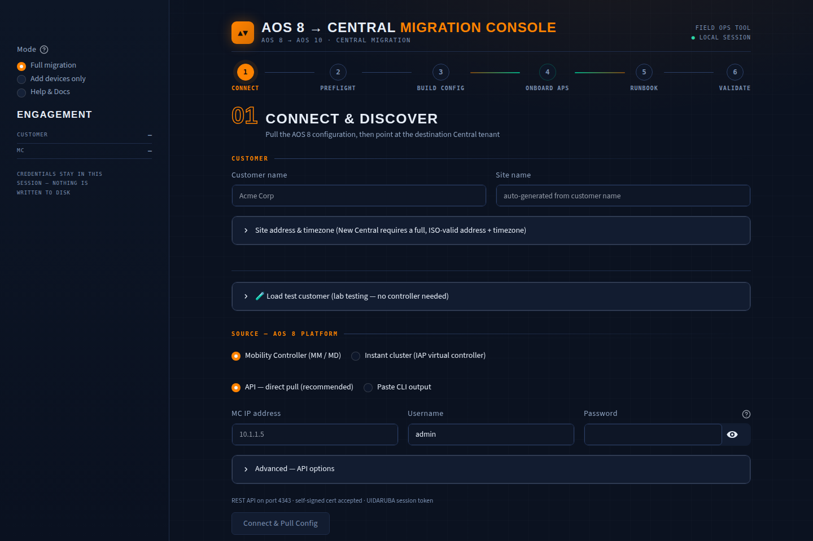

**What you do, in order:**

1. Enter the **Customer name** (drives every generated object name) and,
   optionally, a site name. Open *Site address & timezone* and fill it in —
   New Central validates the address, and blank fields fall back to lab
   placeholders.
2. Pick the **Source platform** (Mobility Controller vs Instant cluster).
3. Pull the config: **API mode** (MC IP + credentials → *Connect & Pull
   Config*) or **Paste CLI output** (one text box per show command → *Parse
   Pasted Output*). No controller handy? Open the *Load test customer*
   expander and load a synthetic scenario instead.
4. Review the **Discovery summary** — AP groups with their SSIDs
   (color-coded tunnel/split/bridge), the AP table with AOS 10 compatibility
   badges, VLANs, RADIUS servers, firmware/cluster chips:

   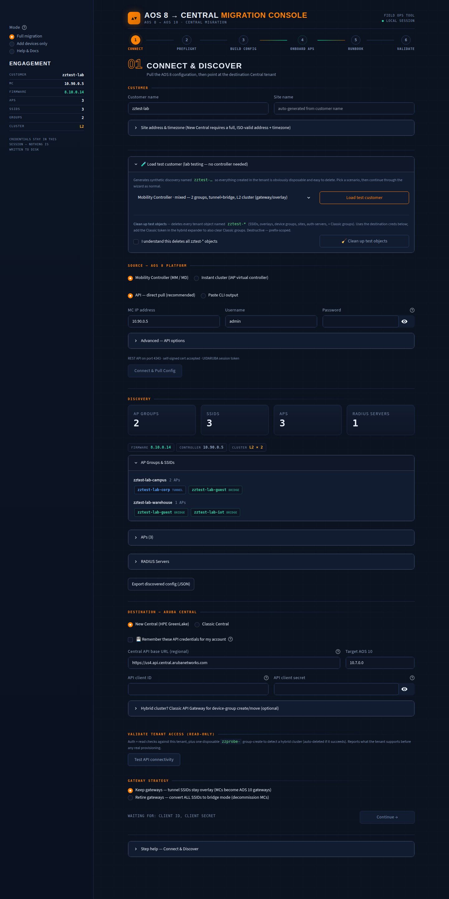

5. Choose the **Destination** (New Central or Classic Central) and enter its
   API credentials. Optionally tick **Remember** to keep them (encrypted) for
   the next launch:

   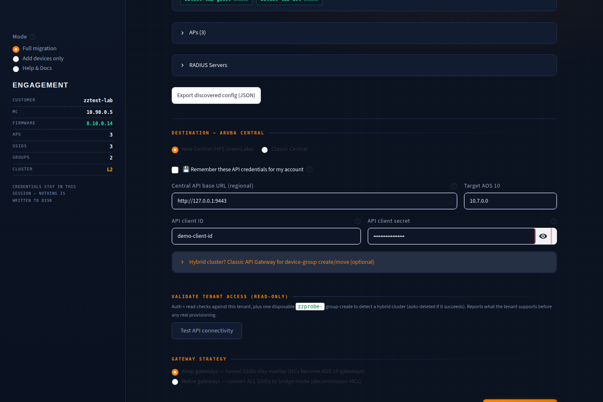

6. Optionally hit **Test API connectivity** — read-only probes that confirm
   auth, scope/site/group reads, and detect hybrid tenants before anything
   is written.
7. If tunnel/split SSIDs were discovered, pick the **Gateway strategy**
   (keep the MCs as AOS 10 gateways, or retire them → everything bridge).
8. **Continue →** builds the target design and moves to Preflight.

What it does behind the scenes:
1. Reads customer name, optional site name + address.
2. Pulls/parses the source config into a `CustomerConfig` (AP groups, SSIDs with
   per-group bindings, auth types/PSKs, AP inventory with serials/MACs, VLANs,
   RADIUS servers, cluster topology).
3. Shows a discovery summary: metrics, firmware/controller/cluster chips, per-group
   SSID lists (color-coded tunnel/split/bridge), AP table with AOS10-compat badges,
   RADIUS servers.
4. Offers a redacted JSON export of the discovered config.
5. Captures destination credentials and (for MC sources with tunnel SSIDs) the
   gateway strategy.

Per-path behaviour:

| Path element | MC source | Instant source |
|---|---|---|
| AP groups | From `ap-group` objects / running-config blocks. APs whose group isn't configured get a synthetic group so none are dropped. | From AP **zones**. No zones → one synthetic group (`instant-cluster`). Zoneless APs land in `instant-default`. |
| SSID→group binding | From `virtual-ap` bindings. If a group has no binding data, ALL SSIDs are assigned as a fallback (→ preflight WARN, `ssid_mapping_incomplete`). | SSID zones map SSIDs to zone groups; zoneless SSIDs broadcast everywhere. |
| Forward mode | tunnel / split / bridge from `forward-mode`. | Always **bridge** (Instant forwards locally). |
| Gateway strategy selector | Shown if any tunnel/split SSID exists. | Never shown. |

Continue is blocked until: AOS 8 config discovered, customer name, Central base
URL, valid target firmware, **and** the destination credentials (New: client ID
+ secret; Classic: access token).

On Continue the tool runs `translate()` to build the `CentralConfig` and advances
to Step 2. **Re-running discovery wipes all downstream state** (see ARCHITECTURE.md
→ reset-on-rediscovery) so a second customer's data can never leak forward.

---

## Step 2 — Preflight Checks

Read-only. Nothing is written to Central. Produces pass / warn / fail
(blocker) results. Blockers must be fixed or explicitly overridden (a checkbox
acknowledging the risk) before you can advance to provisioning.

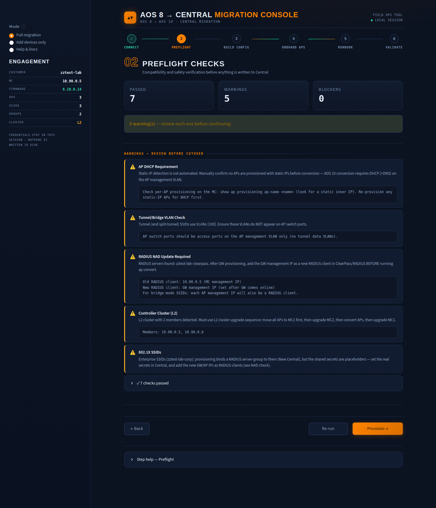

**What you do, in order:**

1. Read every **warning** — each one names the exact object and the action
   to take before cutover (NAD updates, VLAN trunking, cluster sequencing…).
2. Fix any **blocker** at the source (or map named VLANs in the inline
   editor) and hit **Re-run**. Genuinely unavoidable blockers can be
   overridden with the acknowledgement checkbox — the risk is yours.
3. **Provision →** when the list is green enough to proceed.

### What each check means

| Check | Status logic | Meaning / action |
|---|---|---|
| AP Model Compatibility | FAIL if any AP model is on the incompatible list | AOS 10 doesn't support the hardware (e.g. AP-205/AP-215/AP-315 era). Hardware refresh required. Unknown models don't block. |
| MC Firmware Version | PASS if on 8.10 ≥ `.0.12` or 8.12 ≥ `.0.1`; FAIL otherwise; WARN if undetectable | `ap convert` is train-gated. 8.11 does **not** qualify. Paste `show version` if undetectable. |
| Instant Version (Instant source) | PASS if ≥ 8.6.0.0, else WARN | Central-driven conversion needs Instant 8.6+ (8.10/8.12 recommended). |
| AP DHCP Requirement | FAIL if static-IP APs found; otherwise **WARN** (manual gate) | Static-IP provisioning isn't visible to discovery — you must confirm manually (`show ap provisioning ap-name <n>`). AOS 10 requires DHCP+DNS on AP mgmt VLAN. |
| Tunnel/Bridge VLAN Check/Conflict | WARN when tunnel VLANs exist or overlap bridge VLANs; PASS otherwise | Tunnel client VLANs must NOT be on AP switchports; bridge data VLANs must be trunked. Conflict = a VLAN is used both ways. Suppressed when gateways retired. |
| RADIUS NAD Update | WARN when RADIUS servers exist | The RADIUS client (NAD) changes after migration. Add the new NAD (GW mgmt IP, or AP mgmt subnets when bridge/retired) in ClearPass **before** converting. |
| Gateway Retirement | WARN if retiring with former tunnel VLANs; PASS if already all-bridge | Lists the client VLANs that must be trunked to every AP switchport before conversion, plus DHCP/roaming/firewall implications. |
| EAP-Offload / FastConnect | FAIL if `aaa-fastconnect` present | Not supported in AOS 10. Redesign to standard 802.1X first. |
| Internal Authentication Server | FAIL if MC internal auth in use | Not supported in AOS 10. Move to external RADIUS first. |
| Controller Cluster | PASS single MC; WARN for L2/L3 with sequencing note | L2 needs a strict move-then-convert order; L3 members convert independently. Suppressed for Instant. |
| AP Inventory | WARN if no APs discovered; else PASS | Sanity check that discovery found devices. |
| SSID → AP-Group Mapping | WARN if `ssid_mapping_incomplete`; else PASS | Bindings couldn't be read; all SSIDs were assigned to those groups. Re-paste full running-config with ap-group blocks. |
| SSID → Zone Mapping (Instant) | WARN when SSIDs are zoned to a zone with no checked-in AP | Orphaned SSIDs are parked in the `instant-default` group so they aren't lost — verify zone names (typos/case) and intended placement. |
| AP Serial Numbers | WARN if any AP lacks a serial | Serial-less APs can't be pre-assigned or validated in Step 6. Use `show ap database long` or API mode. |
| Named VLANs Unresolved | FAIL if any SSID uses a named VLAN pool | Named VLAN couldn't resolve to an ID; it would land on VLAN 1. Look up the real ID and fix before provisioning. |
| Split-Tunnel SSIDs | WARN when split SSIDs exist | Keep → provisioned as full L2 overlay; Retire → full bridge. AOS 10 per-SSID forwarding differs from AOS 8 split — review traffic paths. |
| Conflicting Duplicate ESSIDs | FAIL if same ESSID has differing vlan/mode/auth/psk | Central keys WLANs by ESSID; only the first definition would provision. Rename or consolidate. |
| Duplicate ESSIDs (same settings) | PASS, informational | Identical duplicate VAPs are consolidated into one Central WLAN. |
| ESSID Length | FAIL if any ESSID > 32 chars | Central rejects them. Shorten first. |
| SSID Auth Detection / PSK / 802.1X | WARN per finding; PASS if all clean | Unknown auth → provisioned as WPA2-Enterprise; missing PSK → set in Central; enterprise → attach RADIUS server post-provision. |

Navigation: Re-run re-evaluates checks; Back returns to Step 1; Provision
advances (gated by the override checkbox when blockers exist).

---

## Step 3 — Build Config (Provision Central)

Writes to the customer tenant. Shows a **manifest** of everything that will be
created, then runs the provisioning sequence with a live per-step pass/fail log.
**Every API failure is reported per step; nothing is silently skipped.** Steps
are idempotent — existing objects with matching names are reused — so you can
fix a failure and use "Reset & re-run provisioning."

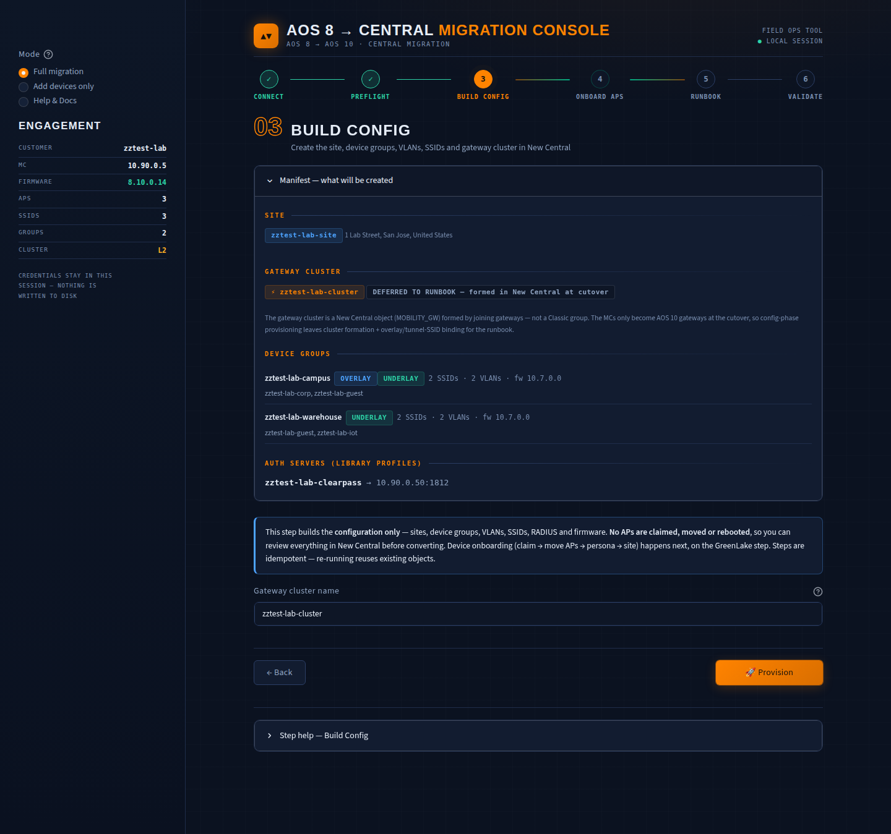

**What you do, in order:**

1. Expand the **manifest** and read exactly what will be created — sites,
   groups, VLANs, SSIDs, auth servers — before anything is written.
2. Hit **Provision** and watch the live per-step log.
3. On failures: fix the cause (the raw API error is shown per step) and use
   **Reset & re-run provisioning** — completed objects are reused.
4. **GreenLake →** when the log is green:

   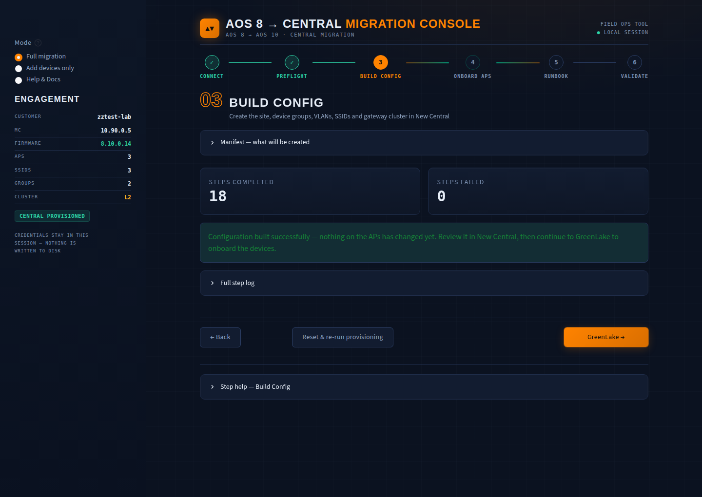

### New Central (paths 1 & 3)

Sequence (`CentralClient.provision`, config phase):
1. Authenticate at GreenLake SSO (pre-check; failure stops here with guidance).
2. Resolve the **global scope id** from `/network-config/v1/scope-maps`
   (`SERVICE_PERSONA`) — a cheap read that proves config access. If this
   fails, nothing else can proceed.
3. Create the **site** (`/network-config/v1alpha1/sites`, falling back to
   `/network-config/v1/sites` then `/network-monitoring/v1/sites` on 404),
   idempotent by name.
4. Create **RADIUS auth-server** library profiles, plus a **server-group**
   that 802.1X SSIDs bind to.
5. Per AP group: create the **device group**, create **VLANs** (`layer2-vlan`
   + scope-map), create **SSIDs** (underlay), set **firmware compliance**.

Two things are deliberately **deferred to later steps** — the log records
them explicitly, nothing is silently dropped:

- **Gateway cluster + overlay (tunnel) SSIDs** — the cluster is a New
  Central object formed by JOINING gateways, and the MCs only become AOS 10
  gateways at cutover. Step 3 records a *manual follow-up* to form the
  cluster; tunnel/split SSIDs are logged as *DEFERRED* and bound after
  cutover (the runbook walks you through it).
- **CAMPUS_AP persona + site assignment** — these need claimed APs, so they
  run in Step 4's cutover move (the `devices` phase).

SSID translation in New Central:

| AOS 8 SSID | New Central object |
|---|---|
| virtual-ap tunnel/split (keep gateways) | DEFERRED at Step 3 — bound as overlay (`FORWARD_MODE_L2`) to the GW cluster after cutover (see runbook) |
| virtual-ap bridge (or anything when gateways retired) | Underlay SSID (`FORWARD_MODE_BRIDGE`), scope-mapped to the group (CAMPUS_AP) |

Duplicate ESSIDs within a group are skipped after the first (recorded as a
benign skip).

### Classic Central (paths 2 & 4)

Sequence (`ClassicCentralClient.provision`):
1. Access check (`list_group_names`) — a 401 means the token expired; generate a
   fresh one.
2. Pre-add serial+MAC pairs to the **classic device inventory** (only serials
   that have a MAC).
3. Create the **site** (`/central/v2/sites`).
4. Per AP group: create the **AOS10 v3 group** (with Gateways allowed if keeping
   gateways), move APs into it, create **WLANs** (`full_wlan`), set **firmware
   compliance**.
5. Assign APs to the site.
6. Append **manual follow-ups** (see caveats).

Classic caveats you will see surfaced:

| Caveat | Behaviour |
|---|---|
| WLAN APIs allowlisted | A **403** on a `full_wlan` call means the tenant isn't allowlisted — ask your Aruba SE to enable the WLAN config APIs. |
| Group-create flaw | The group create can return success without applying. The tool reads the group back and **fails the step** only if `Architecture` confirms it is not `AOS10`. |
| Firmware compliance | Tries `/firmware/v2/...`; on 404/405 falls back to `/firmware/v1/...`. Device type for APs is `IAP` even on AOS 10. |
| RADIUS auth-servers | Cannot be created via classic API → listed as a manual follow-up (create per group in Group → Devices → Config → Security). |
| Gateway clusters | Cannot be created via classic API → gateways auto-cluster when moved into the AOS10 group; verify tunnel SSIDs bind to the cluster in the group WLAN config. Listed as a manual follow-up. |
| Tunnel WLAN binding | `cluster_name` on the WLAN is set but unverified by reference example — confirm in the Central UI after provisioning. |

> The classic refresh token may rotate during this step; the tool saves the new
> one to the session and shows a banner. Update your stored copy.

---

## Step 4 — GreenLake Onboarding

Claims the APs into the GreenLake workspace, assigns them to the Central
application + a subscription, and (at cutover time) moves them into their
device groups — so Central adopts them the moment they convert. Optional if
you've already claimed via the GreenLake UI / CSV, but recommended order is:
provision → claim → convert.

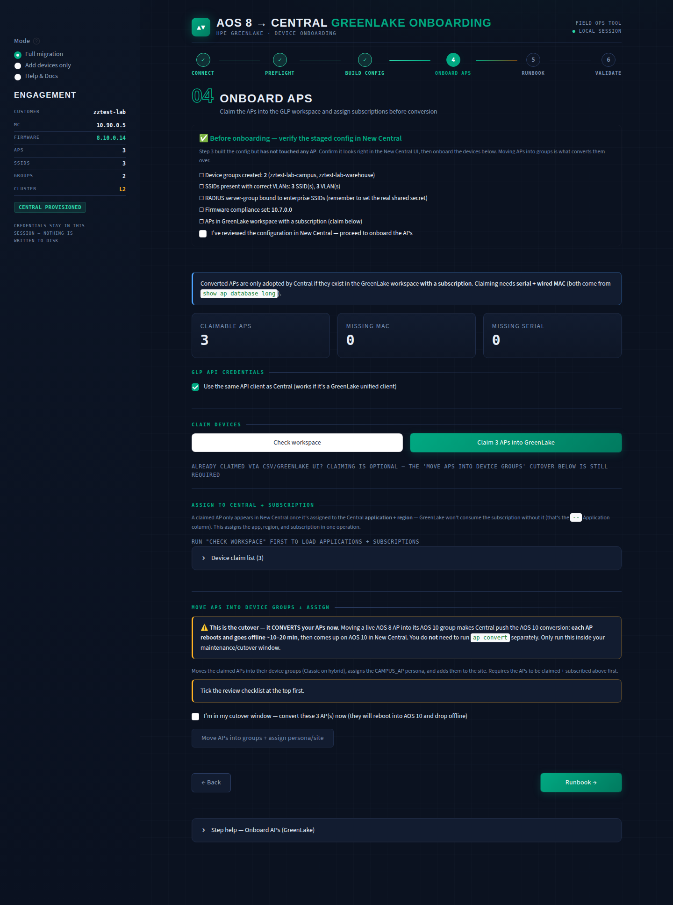

**What you do, in order:**

1. Review the **pre-onboarding checklist** (New Central) — it summarizes what
   Step 3 staged so you confirm the config before touching APs.
2. Check the **claim buckets**. APs missing a wired MAC can be fixed inline
   (*Add wired MACs* expander) without re-running discovery.
3. **Check workspace** — authenticates to GLP, lists existing inventory,
   loads subscriptions, marks which APs are already claimed.
4. **Claim N APs into GreenLake** — async; the tool polls to completion and
   then re-reads the workspace to verify every serial actually landed:

   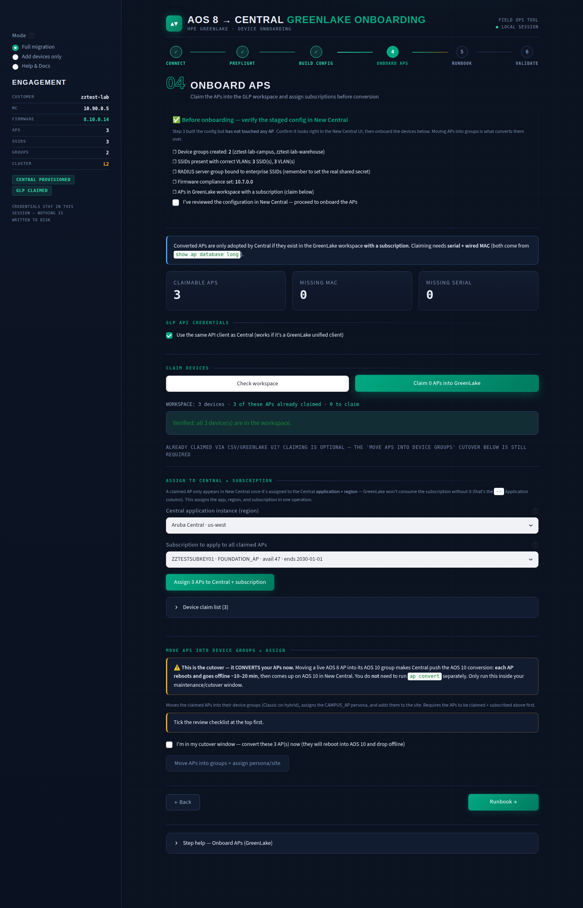

5. **Assign APs to Central + subscription** — pick the Central application
   instance (with its region) and an **active** subscription (AP
   subscriptions listed first). Two sequential merge-patches per device
   (GLP rejects combining them): application+region first, then the
   subscription. Without the application assignment Central never adopts
   the APs.
6. At cutover: **Move APs into groups + assign persona/site** — the
   `devices` phase of provisioning. This is the conversion trigger for
   pre-assigned APs; it also assigns the CAMPUS_AP persona and the site.

What it does behind the scenes:
1. Buckets APs into **claimable** (serial + MAC), **missing MAC**, **missing
   serial**. Only claimable APs can be onboarded automatically.
2. **Claim** — `POST /devices/v1/devices` with serial+MAC pairs. This is an
   **async** operation: the tool polls the async-operation until done, then
   reconciles the submitted serials against the **actual workspace inventory**
   (it never trusts the async body shape alone). Serials not found post-claim are
   flagged as must-resolve.
3. **Application + subscription** — `PATCH /devices/v2beta1/devices`
   (merge-patch, one PATCH for `application`+`region`, a second for
   `subscription`), each polled to a terminal state when GLP answers 202.

| Bucket | Cause | Fix |
|---|---|---|
| Claimable | Has serial + wired MAC | Ready to claim. |
| Missing MAC | Serial known, no MAC | Re-discover with `show ap database long`, or add manually in GreenLake. macAddress is **required** by GLP. |
| Missing serial | No serial at all | Discovery used `show ap active` (no serial column). Re-discover. |

Path notes:
- **Classic destination:** Step 3 already pre-added serial+MAC to the classic
  inventory. This GreenLake step applies to GLP-onboarded classic accounts
  (most current ones). If the account predates GreenLake onboarding, skip to the
  runbook.
- **GLP credentials:** by default reuse the Central client (works if it's a
  unified GreenLake client). Otherwise enter a separate GLP client ID/secret.

GreenLake calls always go to the fixed base `https://global.api.greenlake.hpe.com`
regardless of the Central region.

---

## Step 5 — AP Convert Runbook

Generates a **customer-specific** runbook and shows gateway-migration guidance.
Gated behind Step 3 (you must provision Central first — converted APs look for
their config in Central). Downloadable as `.txt`.

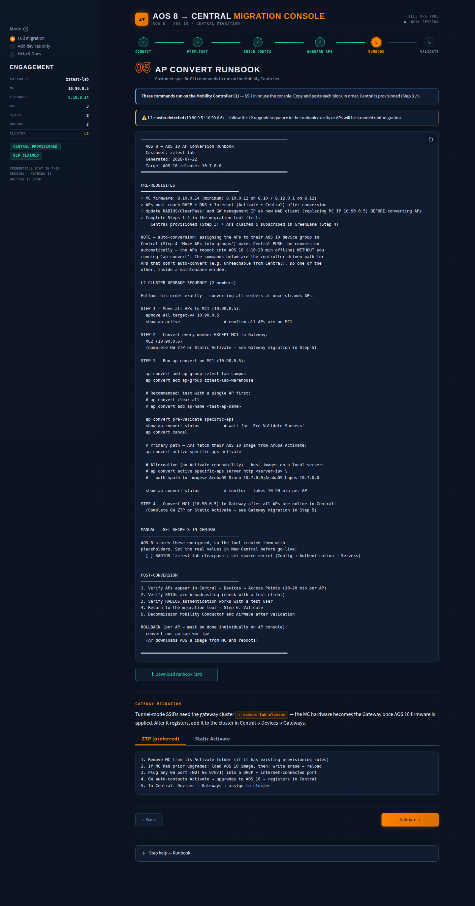

**What you do, in order:**

1. Read the pre-requisite warnings at the top — they adapt to your path
   (firmware minimums, NAD updates, VLAN trunking when retiring gateways).
2. **Download** the runbook (`.txt`) and review it with the customer.
3. Execute it on the MC CLI during the maintenance window — it includes the
   pre-validate/cancel/convert sequence and the cluster ordering.
4. Follow the gateway-migration guidance below the runbook (ZTP or static
   Activate for kept gateways; decommissioning steps for retired ones).

The runbook content depends on source and cluster topology:

| Scenario | Runbook shape |
|---|---|
| Instant source | Central-driven conversion — **no controller CLI, no `ap convert`, no gateways**. Remove conflicting Activate/AirWave rules; firmware compliance on the group pushes the image; canary one AP first. |
| MC, single controller | Pre-reqs, optional MC→Gateway prep (or "MC only drives convert" when retiring), then the `ap convert` block. |
| MC, **L2** cluster | Strict sequence: move all APs to MC1 → convert MC2 to gateway (or leave idle if retiring) → `ap convert` on MC1 → convert MC1. |
| MC, **L3** cluster | Members convert independently: per member, move its APs to a peer, convert from the peer, then convert/decommission the emptied MC. |

The `ap convert` block (verified against the AOS-W 8.x CLI reference):

```
ap convert add ap-group <each discovered group>
ap convert pre-validate specific-aps
show ap convert-status            # wait for 'Pre Validate Success'
ap convert cancel
ap convert active specific-aps activate   # APs pull AOS 10 from Aruba Activate
show ap convert-status            # 10–20 min per AP
```

`activate` is the primary path (APs fetch their own image). A commented
**manual image-server alternative** is included only for AP families whose AOS 10
image codename is confidently known (per the Instant release-notes image-class
tables: 303 → Scorpio, 318/37x → Gemini, 344/345 + 50x/51x/518/57x → Draco,
53x/55x/58x → Lupus, 635/655 → Norma); unmapped models get an explicit "verify the image, do NOT
guess" placeholder.

Pre-req warnings adapt to the path:
- Firmware below the train minimum prints a **MUST upgrade** warning.
- RADIUS present → update ClearPass NAD (AP mgmt subnets when bridge/retired, GW
  mgmt IP when keeping gateways) before converting.
- Gateways retired → trunk former tunnel client VLANs to every AP switchport
  before converting.

Gateway migration guidance (shown below the runbook):
- **Keep gateways:** ZTP (preferred) or Static Activate tabs to bring the MC up
  as an AOS 10 gateway and join the cluster in Central.
- **Retire gateways:** no ZTP; decommission MCs after Step 6; confirm switchport
  changes are done first.
- **All bridge already:** no gateway needed; APs connect directly to Central.

Rollback is per-AP from the AP console (`convert-aos-ap cap <mc-ip>` for MC
sources; boot the Instant partition for Instant).

---

## Step 6 — Validate

Confirms converted APs are online in Central by serial, and provides a
post-migration checklist.

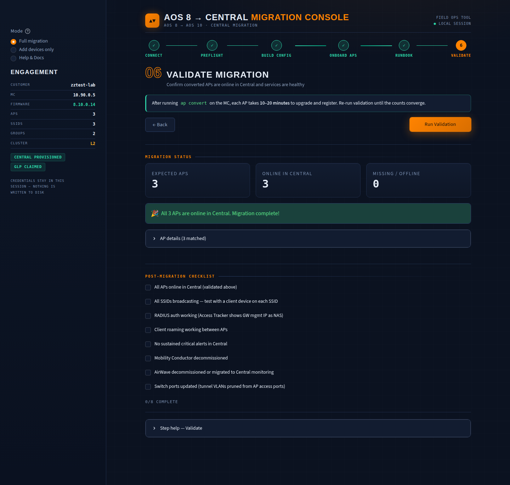

**What you do, in order:**

1. Hit **Run Validation** — each converted AP takes 10–20 minutes to upgrade
   and register, so re-run until Expected = Online.
2. Chase any serial in the **Missing / Offline** list (console cable, DHCP,
   Activate rules are the usual suspects).
3. Work through the **post-migration checklist** — 8/8 marks the engagement
   closed out.

What it does behind the scenes:
1. Builds the **expected** set from discovered AP serials (serial-less APs can't
   be matched — flagged).
2. **Run Validation** fetches all APs from Central (New: `/network-monitoring/v1/devices`;
   Classic: `/monitoring/v2/aps`) and matches by serial.
3. Shows Expected / Online / Missing-or-Offline counts, lists serials not yet
   seen, and a matched-AP detail table.
4. All expected APs online → success + balloons (once). Otherwise a progress
   message (conversion takes 10–20 min/AP — re-run until counts converge).
5. **Post-migration checklist** (manual): APs online, SSIDs broadcasting, RADIUS
   working, roaming, no critical alerts, MC decommissioned, AirWave
   decommissioned, switchports updated. 8/8 marks the engagement closed out.

If the device fetch fails entirely (returns nothing), the tool tells you to check
the API client's monitoring permissions and retry.

---

## Beyond the wizard

Two more modes live in the sidebar's **Mode** switch:

- **Add devices only** — onboard APs into groups that already exist in the
  tenant: claim → subscribe → move → persona, skipping discovery and config
  entirely. Feed it a pasted `show ap database long` or a serial+MAC list.

  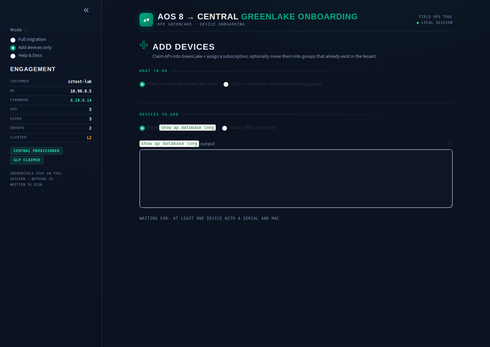

- **Help & Docs** — how each page works, the exact API calls behind it
  (curl + a generated Postman collection), and how to create the API keys.

  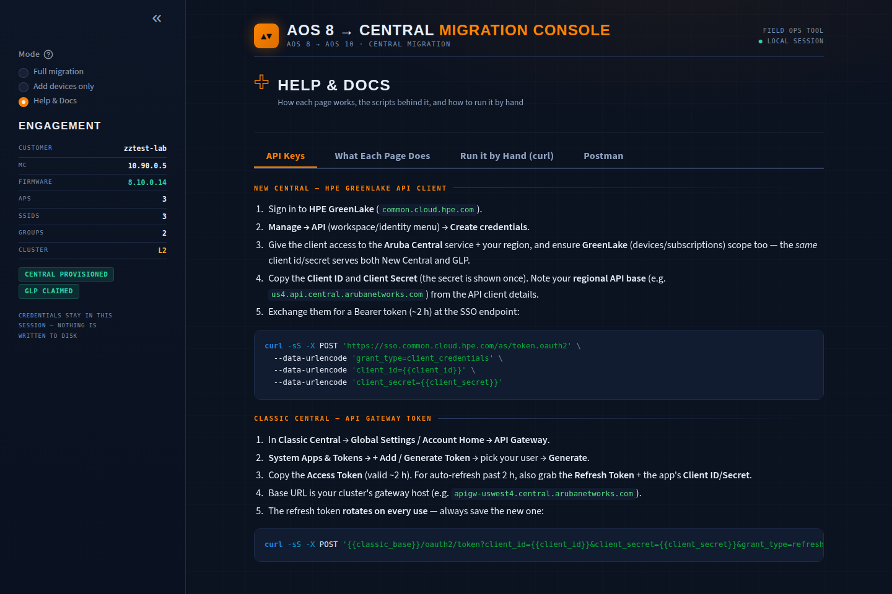
